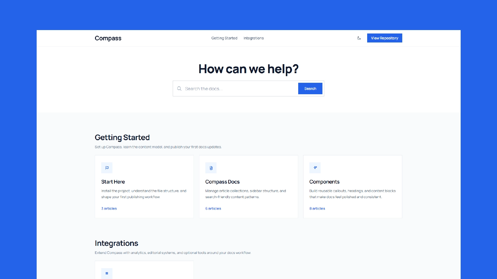

# Compass

[](https://astro.build/)
[](https://tailwindcss.com/)
[](https://www.typescriptlang.org/)
[](https://docs.astro.build/en/guides/integrations-guide/mdx/)
[](./LICENSE)

Compass is a clean Astro documentation theme for product docs, support centers, and internal knowledge bases. It combines MDX content collections, category-driven navigation, Pagefind-powered search, reusable content components, and a polished light/dark UI without pulling in a heavyweight docs framework.

**Preview:** [https://compass-lilac-tau.vercel.app/](https://compass-lilac-tau.vercel.app/)

[](https://compass-lilac-tau.vercel.app/)

## Highlights

- Built with Astro 6 and Tailwind CSS 4
- MDX content collections for article authoring
- Parent categories, sub-category pages, and article routes
- Expanded article frontmatter for tags, status, edit links, hero images, redirects, and search visibility
- Previous and next article navigation within each docs section
- Searchable docs landing page and sidebar search powered by Pagefind
- Optional RSS feed for recent docs updates at `/rss.xml`
- Reusable docs components like callouts, tabs, badges, tables, cards, steps, accordions, checklists, buttons, and quotes
- Dedicated code tabs for command and framework variants inside MDX articles
- File tree blocks for documenting repo structure and editing paths
- Syntax-aware code blocks with language headers for code-focused snippets
- Light and dark mode support
- Shared site config for branding, links, and CTA text
- Sitemap support for production builds
- MIT licensed

## Tech Stack

- `astro`
- `@astrojs/mdx`
- `@astrojs/rss`
- `@astrojs/sitemap`
- `tailwindcss`
- `@tailwindcss/typography`
- `pagefind`
- `typescript`

## Quick Start

```bash
npm install
npm run dev
```

Open `http://localhost:3000`.

Search is generated during `npm run build`, so use `npm run preview` when you want to test the full search experience locally.
Compass also generates an RSS feed for docs updates at `/rss.xml`.

Useful scripts:

```bash
npm run dev
npm run build
npm run preview
npm run check
npm run clean
```

## Project Docs

- [Contributing guide](./CONTRIBUTING.md)
- [Changelog](./CHANGELOG.md)

## Theme Setup

The main theme settings live in [site.config.mjs](./site.config.mjs).

Update these before publishing:

- `siteUrl`
- `name`
- `title`
- `description`
- `githubUrl`
- `navCtaLabel`
- `navCtaHref`
- `footerText`

## Writing Docs

Documentation content lives in `src/content/docs`.

Each article lives in its own folder with a slug-matched `.mdx` file:

```text
src/content/docs/compass-docs/get-started-with-docs/
`-- get-started-with-docs.mdx
```

Inside that article file, use frontmatter like this:

```mdx
---
title: "Set Up Compass"
description: "Start customizing the theme and content structure."
category: "start-here"
tags: ["setup", "branding"]
status: "published"
author: "Docs Team"
editUrl: "https://github.com/your-org/your-repo/edit/main/src/content/docs/start-here/set-up-compass/set-up-compass.mdx"
heroImage: "./hero.png"
redirectFrom:
  - "/start-here/getting-started"
order: 1
updatedAt: 2026-06-03
---

## Add your content here
```

Useful optional frontmatter fields:

- `tags` for future filters, grouping, or editorial workflows
- `status` for lifecycle states like `draft`, `published`, `deprecated`, or `archived`
- `author` for ownership metadata
- `editUrl` to show an "Edit this page" link on article pages
- `heroImage` for a top-of-page article image loaded through Astro's image pipeline
- `hideFromSearch` to keep a page out of the Pagefind index
- `redirectFrom` to generate redirect aliases for renamed or moved docs routes
- `relatedLinks` to render end-of-article recommendation cards for next steps or related guides

If an article includes screenshots or diagrams, keep them beside the article entry:

```text
src/content/docs/compass-docs/adding-images/
|-- adding-images.mdx
`-- docs-image-placeholder.png
```

Compass uses this folder-per-article pattern everywhere so contributors never have to choose between flat files and nested entries. It also keeps article-owned images in `src/`, where Astro can optimize them and generate responsive output.

Inside MDX, use either a relative Markdown image:

```mdx

```

or Astro's image component when you need more control:

```mdx
import { Image } from 'astro:assets';
import diagram from './docs-image-placeholder.png';

<Image src={diagram} alt="Diagram" width={1200} layout="constrained" />
```

Use `public/` only for assets that need a stable direct URL and should not be processed by Astro, such as favicons or Open Graph images.

Categories are defined in [src/data/docs.ts](./src/data/docs.ts). That file powers:

- homepage cards
- top-level category organization
- sidebar navigation
- category and article route generation

The content tree mirrors those category slugs:

- `src/content/docs/start-here`
- `src/content/docs/compass-docs`
- `src/content/docs/components`
- `src/content/docs/channels-and-apps`

## Reusable Components

Compass includes MDX-ready components for richer docs pages:

- `Callout`
- `ButtonLink`
- `Card`
- `CardGrid`
- `Badge`
- `QuoteBlock`
- `Accordion`
- `Steps`
- `Step`
- `Tabs`
- `CodeTabs`
- `FileTree`
- `Table`
- `Checklist`

They are registered in [src/components/docs/mdx-components.ts](./src/components/docs/mdx-components.ts) and used automatically in article routes.

If you add your own Astro component, register it there to make it available inside `.mdx` articles.

## Project Structure

```text
.
|-- public/
|   `-- icons/
|-- src/
|   |-- components/
|   |   `-- docs/
|   |-- content/
|   |   `-- docs/
|   |-- data/
|   |   `-- docs.ts
|   |-- layouts/
|   |-- pages/
|   `-- index.css
|-- astro.config.mjs
|-- package.json
|-- site.config.mjs
`-- tsconfig.json
```

## Publishing Notes

- `site.config.mjs` still contains placeholder URLs by default.
- `astro.config.mjs` uses the value from `site.config.mjs` for the canonical site URL.
- `astro.config.mjs` enables responsive local images by default with Astro's image pipeline.
- `npm run build` generates the static site, RSS feed, sitemap, and Pagefind search bundle.
- If you plan to publish this package, update the package metadata in `package.json`.

## License

[MIT](./LICENSE)
