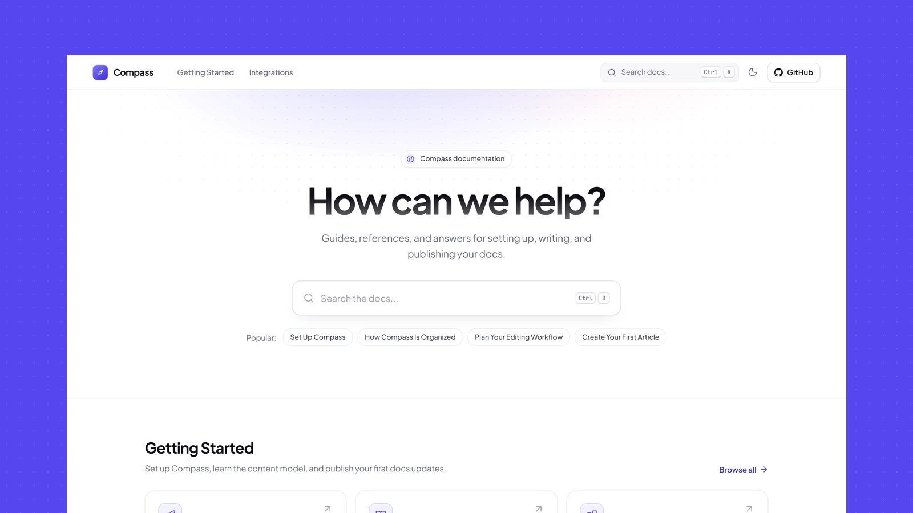

# Compass - Astro Documentation Theme

[](https://compass.xocoweb.workers.dev/)

[](https://astro.build/)
[](https://tailwindcss.com/)
[](https://www.typescriptlang.org/)
[](./LICENSE)

**Live preview:** https://compass.xocoweb.workers.dev/

Compass is a free Astro theme for product documentation, help centers, and internal knowledge bases. It pairs a calm, editorial reading experience with the tools readers expect from a modern docs site: a search palette on every page, a full section sidebar, and an "On this page" rail. Content is MDX validated by Astro content collections, the structure lives in a few config files, and the output is fully static.

## Features

- A `Ctrl/⌘ + K` search palette on every page, powered by Pagefind, with highlighted excerpts and popular articles before the first keystroke
- A homepage with a search hero, popular article chips, category cards, a recently updated list, and a closing support band
- Parent sections, categories, and articles defined in one config file, with matching landing pages for each level
- A docs sidebar that lists every article in the section, grouped by category
- An "On this page" rail that tracks the current heading, with a compact version on smaller screens
- Article headers with reading time, last updated date, a "Copy page" button, and heading anchor links
- Previous and next article cards, related links, and "Edit this page" links generated for every article
- MDX components available in every article without imports: callouts, badges, buttons, cards, card grids, steps, tabs, code tabs, file trees, tables, accordions, checklists, and quotes
- Dual-theme syntax highlighting with language labels and a copy button on every code block
- An image lightbox for article screenshots and diagrams
- Light and dark modes that follow the system until a reader picks one, applied before first paint
- Article lifecycle states, so drafts and archived pages stay out of routes, navigation, search, and feeds
- Redirects from old URLs declared in frontmatter
- RSS, sitemap, `robots.txt`, `llms.txt`, canonical URLs, Open Graph, Twitter/X cards, and JSON-LD
- Self-hosted Plus Jakarta Sans and JetBrains Mono, a local Lucide icon set, and design tokens in one stylesheet
- Static output with no framework islands
- Skip link, landmarks, labelled controls, visible focus states, keyboard-friendly search and tabs, and reduced-motion support

## Tech Stack

- Astro 7 with MDX
- Tailwind CSS 4 via the Vite plugin
- TypeScript, Astro content collections
- Pagefind for static search
- `@astrojs/sitemap`, `@astrojs/rss`, Sharp
- Self-hosted Plus Jakarta Sans and JetBrains Mono, Lucide and Bootstrap Icons, each with its license notice

## Requirements

- Node.js `22.12.0` or newer
- npm

## Getting Started

```bash
npm install
npm run dev
```

Build for production:

```bash
npm run build
```

Preview the production build locally:

```bash
npm run preview
```

Search is generated during the build, so use `npm run build` and `npm run preview` to try it.

Before shipping a change, run type checking, the production build, and the formatter check together:

```bash
npm run release:check
```

## Customization

See [CUSTOMIZATION.md](./CUSTOMIZATION.md) for site settings, the docs structure, the homepage, search, articles and their frontmatter, MDX components, icons, the theme's design tokens, fonts, and dark mode.

Set `siteConfig.siteUrl` in [src/config/site.ts](./src/config/site.ts) before building — canonical URLs, social images, the sitemap, the feed, `llms.txt`, and the structured data are all derived from it. The build is static, so any host that serves a directory works: `wrangler.jsonc` is included for Cloudflare Workers, and Netlify, Vercel, GitHub Pages, and object storage behind a CDN need no configuration beyond `npm run build`.

## Content

Articles live in [src/content/docs](./src/content/docs), one folder per article, validated by the schema in [src/content.config.ts](./src/content.config.ts). The folder name is the article's URL slug, and the `category` in its frontmatter must match a category in [src/config/docs.ts](./src/config/docs.ts).

The bundled articles document Compass itself, so they double as a guide while you set it up. Replace them with your own content before launch.

## Support

Compass is free and provided as-is. Bug reports and questions are welcome as [GitHub issues](https://github.com/xocothemes/compass/issues); custom design and feature work is not included. See [CONTRIBUTING.md](./CONTRIBUTING.md) to propose a change, and [CHANGELOG.md](./CHANGELOG.md) for release history.

## License

MIT — free for personal and commercial projects. See [LICENSE](./LICENSE), which also lists the licenses of the bundled fonts and icons.

## Credits

- [Plus Jakarta Sans](https://github.com/tokotype/PlusJakartaSans) by Tokotype, under the SIL Open Font License
- [JetBrains Mono](https://github.com/JetBrains/JetBrainsMono) by JetBrains, under the SIL Open Font License
- [Lucide](https://lucide.dev/), under the ISC License
- [Bootstrap Icons](https://icons.getbootstrap.com/), under the MIT License
- [Pagefind](https://pagefind.app/), under the MIT License
